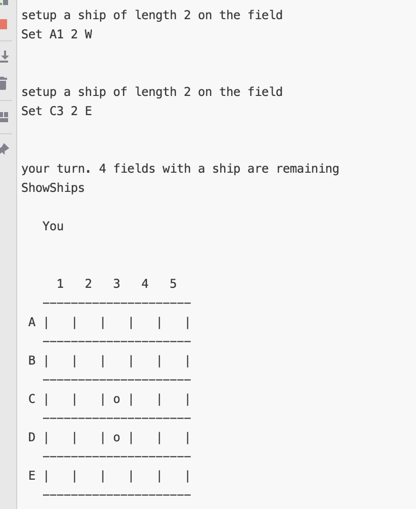

# Todo

## wäre gut
- [ ] es gibt kein "Schiff 1 versenkt", dann "Schiff 2 versenkt" -- Spiel ist einfach aus, wenn  alle Felder mit Schiffen getroffen wurden

## wäre nett
- [ ] doppelte eingaben abfange
- [ ] Schiffe auf benachbarten Feldern verhindern
- [ ] Variable Brettgröße mit unterschiedlichen Schiffgrößen

## erledigt
- [x] überdeckende ships für computer verhindern
- [x] überdeckende inputs checken. Beispiel: `Set A1 2 S` und `Set B2 2 W` ist legal
- [x] beim HumanPlayer die Schiffe anzeigen in ```drawBoards (game: Game) ```
- [x] Ausgabe, wo hat der Computer probiert: das eigene Brett anpassen
- [x] Bug: am Spielfeld rand wird ein Schiff nicht gesetzt?\
    wenn ein invalides schiff gesetzt wird, dann wird der Game Status auf den nächsten Index gesetzt, dass sollte nicht
    sein. siehe screenshot: bei Eingabe ```Set A1 2 W``` sollte eine Fehlermeldung erscheinen und der GameStatus nicht upgedated werden, da das schiff nicht auf das Board passt.

- [x] remove SetNew and rename to Set
- [x] Spiel beenden
- [x] Schiffformen  Computer Random generiert anpassen (2er Schiffe, 3 Stk)
- [x] Schiffformen (2er Schiffe, 3 Stk)
- [x] der Code in ```setShip``` macht nicht das was er soll ```match shipOnBoard (s, game.Size) with``` und man kann große Schiffe setzen

## Bug:


